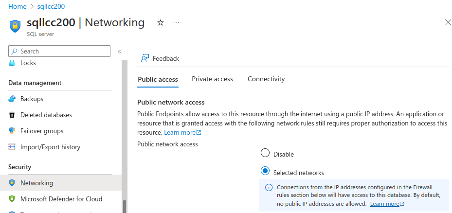
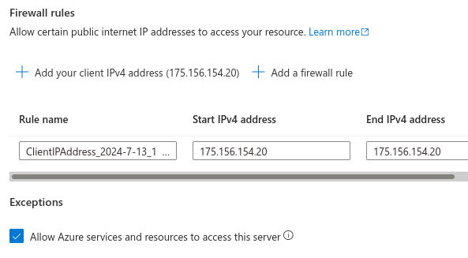

# Using Azure SQL with web app

## Set public network acess

In the **Networking** tab, set the **Public network access** to **Selected networks**.

## Set Client IP address and other Azure apps

- In **Firewall rules** add in my own client IPv4 address.
- Check the **Allow Azure services and resources to access this server.

## Database connection parameters 

The following must be set:
- DATABASE_DRIVER
- DATABASE_SERVER
- DATABASE_NAME
- DATABASE_USER
- DATABASE_PASSWORD
